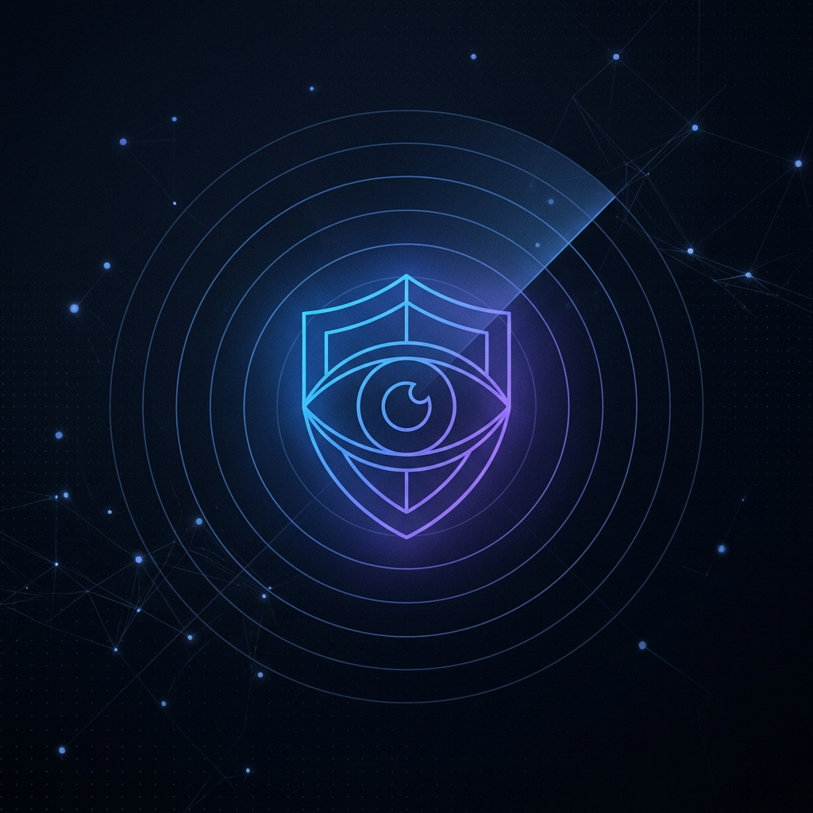
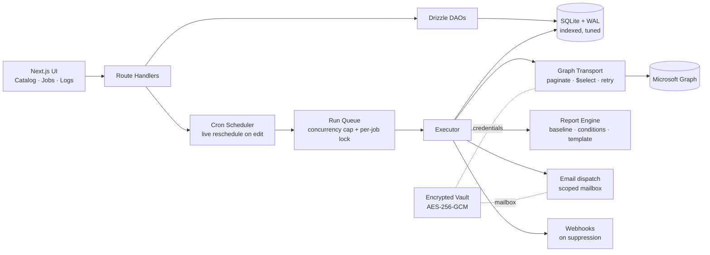
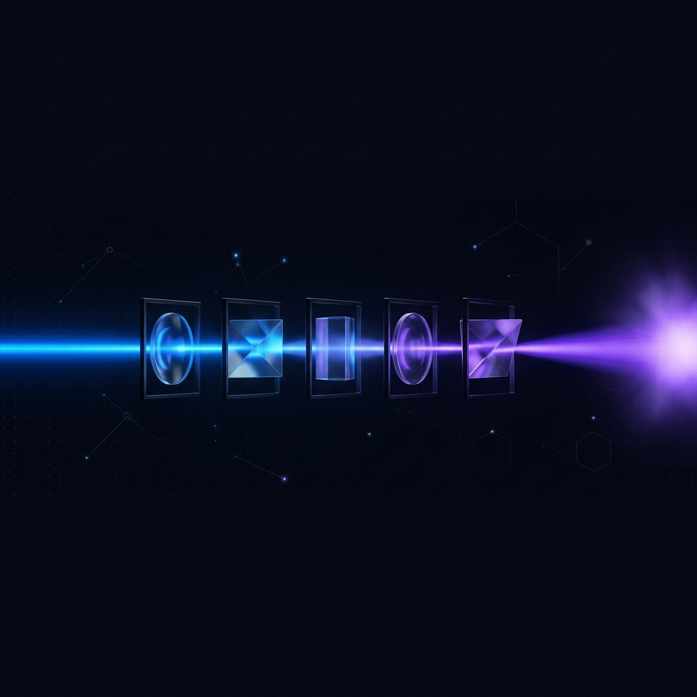
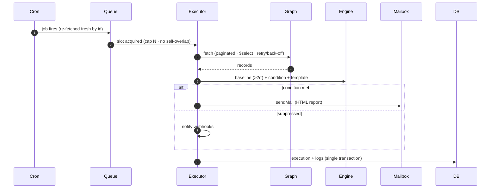

<p align="center">
  
</p>

<h1 align="center">Argus</h1>

<p align="center">
  <strong>The all-seeing eye for your Microsoft 365 tenant.</strong><br/>
  Self-hosted, Dockerized notification &amp; reporting for IT admins and security teams.
</p>

<p align="center">
  
  
  
  
  
</p>

---

## What is Argus?

Argus replaces manual Microsoft Graph querying with **scheduled, automated reports** that
land in your inbox only when they matter. It connects to the Graph API with
**least-privilege, app-only permissions**, runs report jobs on a schedule, applies
baseline anomaly detection and conditional logic, renders HTML email reports, and delivers
them from a single scoped shared mailbox.

The whole stack — UI, scheduler, database, and worker — runs in **one Docker container**.
The operational model is Jenkins-inspired: **Catalog → Jobs → Executions → Logs**.

> Named after Argus Panoptes, the hundred-eyed giant of Greek myth — the ever-watchful guardian.

---

## Run it with an AI agent

Hand this to any AI coding agent (Claude Code, Cursor, etc.) and it will bring Argus up:

```text
This repo is "Argus", a self-hosted Microsoft 365 reporting app (Bun + Next.js 16 + SQLite, single container).
Read README.md, then run `./install.sh` for local dev or `./install.sh docker` for containers.
The ONLY required secret is ARGUS_MASTER_KEY — install.sh generates it into .env automatically.
When it's up, open http://localhost:8100 and confirm GET /api/health returns {"status":"healthy"}.
```

---

## Quick start

One command — generates the vault key, installs, migrates, seeds, and serves:

```bash
./install.sh            # local dev (Bun)    → http://localhost:8100
./install.sh docker     # containerized      → http://localhost:8100
```

<details>
<summary>Manual steps (if you'd rather not use the script)</summary>

```bash
bun install
export ARGUS_MASTER_KEY=$(openssl rand -hex 32)   # the one required secret
bun run db:migrate      # apply schema to the local SQLite database
bun run db:seed         # report templates + default integration
bun run dev             # http://localhost:8100
```
</details>

`ARGUS_MASTER_KEY` (64 hex chars = 32 bytes) is the **only** required environment variable.
Every other secret — Entra ID tenant/client/secret and the mailbox — is entered through the
UI and stored **AES-256-GCM-encrypted** in the database, never in `.env`.

See [`INSTALL.md`](INSTALL.md) for prerequisites, Docker details, and troubleshooting.

---

## How it works

Argus is a small set of cooperating services around an append-only SQLite store.



### The execution pipeline

<p align="center">
  
</p>

Every run flows through the same five stages — fetch, analyze, decide, render, deliver:



---

## Stack

| Layer | Technology |
|-------|-----------|
| Runtime | Bun 1.3 |
| Framework | Next.js 16 (App Router, React 19) |
| Language | TypeScript (strict) |
| Database | SQLite (`bun:sqlite`) + WAL, tuned pragmas, hot-path indexes |
| ORM | Drizzle ORM |
| Encryption | AES-256-GCM (Bun `crypto`) |
| UI | Custom design system + in-house SVG icon set (no component library) |
| Styling | Tailwind CSS |
| Scheduler | node-cron + bounded run queue |
| Graph API | `@microsoft/microsoft-graph-client` (pagination, `$select`, Retry-After) |
| Auth | Entra ID Client Credentials (app-only) |
| Email | Graph `sendMail` (scoped shared mailbox) |

---

## Features

- **26 built-in reports** across Identity, Security, Infrastructure, CSV usage reports, plus a Custom Manual Graph Query.
- **Editable HTML / plain-text templates** with live preview and dynamic variables (`{{organization_name}}`, `{{count}}`, `{{anomalyBanner}}`, `{{detailsTable}}`, …) — a default template is seeded per report.
- **Conditional execution** (always · threshold · changed · anomaly · new-items) with baseline anomaly detection (>2σ) and once-a-day pruning.
- **Suppressed-execution webhooks** with per-URL retry and full report HTML payloads.
- **Encrypted vault** (AES-256-GCM) + one-click Test Connection — all configured in the UI.
- **Live scheduling** — create/edit/delete a job and the cron schedule updates instantly, no restart.
- **Bounded concurrency** — a run queue caps simultaneous Graph load and prevents a job overlapping itself.
- **Premium UI** — custom logo &amp; iconography, dark/light, status pills, metric cards, console log viewer, catalog→template→create-job flow.

---

## Scripts

| Script | Purpose |
|--------|---------|
| `bun run dev` | Next.js dev server (under Bun) |
| `bun run build` | Production build |
| `bun run start` | Serve production build (under Bun) |
| `bun test tests/` | Unit + integration tests |
| `bun run e2e` | Playwright end-to-end tests |
| `bun run db:migrate` | Apply migrations |
| `bun run db:seed` | Seed default templates + integrations |
| `bun run db:generate` | Generate Drizzle migrations |

---

## Security

- **Least-privilege only** — no broad `Mail.Send`; Exchange Online RBAC scoped to one mailbox.
- All credentials **encrypted at rest** with AES-256-GCM.
- The master key lives **only in process memory** — never persisted or logged.
- If `ARGUS_MASTER_KEY` is lost, encrypted credentials are **irrecoverable**.

---

## Documentation

| Doc | Contents |
|-----|----------|
| [`INSTALL.md`](INSTALL.md) | Install, Docker, troubleshooting |
| [`docs/prd.md`](docs/prd.md) | Product requirements |
| [`docs/spec.md`](docs/spec.md) | Technical specification + acceptance criteria |
| [`docs/plan.md`](docs/plan.md) | Phased implementation plan |
| [`docs/spec-backend-efficiency.md`](docs/spec-backend-efficiency.md) | Backend efficiency overhaul spec |

---

## Status

Production build: full 12-report catalog, editable templates, premium custom UI,
tuned database + live scheduler + efficient Graph transport, unit + integration + E2E
tests, single-container Docker.

---

<p align="center"><sub>Powered by caffeine and questionable life choices.</sub></p>
